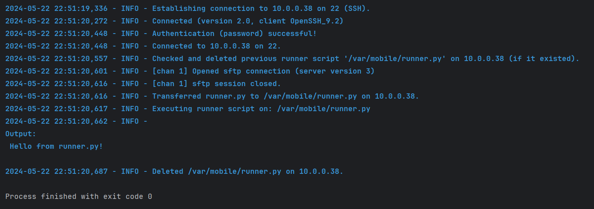

# Python-iOS-Runner

## Description
Python-iOS-Runner is a tool that allows you to run a Python script on jailborken iOS devices from your local machine.
It redirects the scripts I/O to your local machine, so it is super comfortable to run and test on an IDE.

## Requirements:
- A jailbroken iOS device.
- **Python3** and **Open-SSH** packages installed on your device (you can get it from Sileo/Zebra/Cydia/etc...)

## How it works
- There are 2 python scripts:
  - **control.py**
  - **runner.py**
- **control.py** runs on your local machine and does the following:
  - Connects via SSH to your jailbroken device. 
  - Transfers **runner.py** to the iOS device via SFTP.
  - Sends a command to the iOS device to execute **runner.py** via the on-device python interpreter.
  - Collect the output and errors (if exists) and logs them on your local machine.
- **runner.py** is where you come in. Modify it with whatever logic you want.

## Usage

1. Clone this repository. I recommend using PyCharm, but you can also:
   ```bash
   git clone https://github.com/noobexon1/Python-iOS-Runner.git
   
2. Install requirements from **requirements.txt**:
   ```bash
   cd <path_to_cloned_repo>
   pip install -r requirements.txt

3. Edit **config.py** according to your needs.

4. When you are all set, run:
    ```bash
   python3 control.py   

## Example Run:




